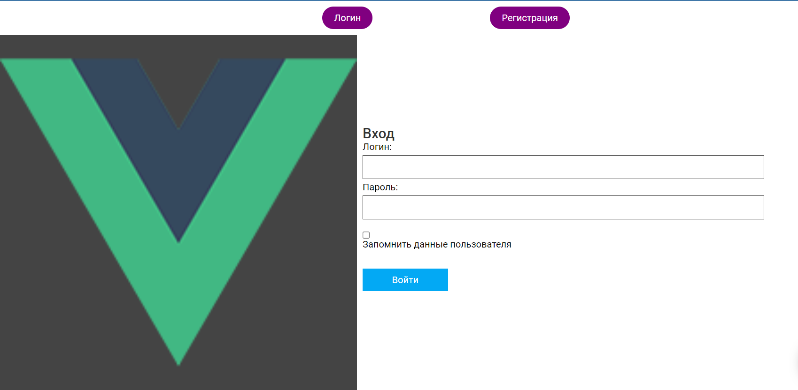
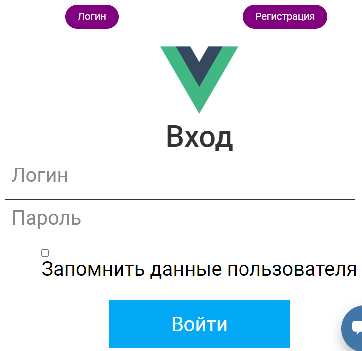
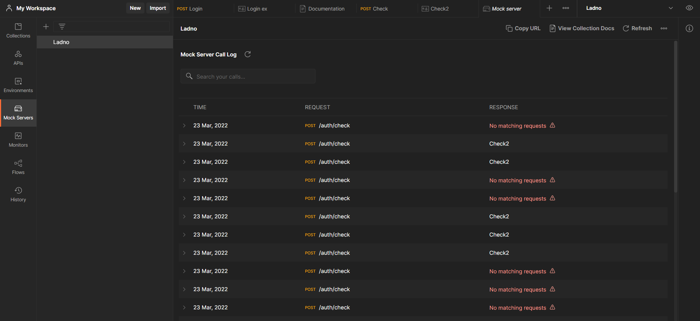
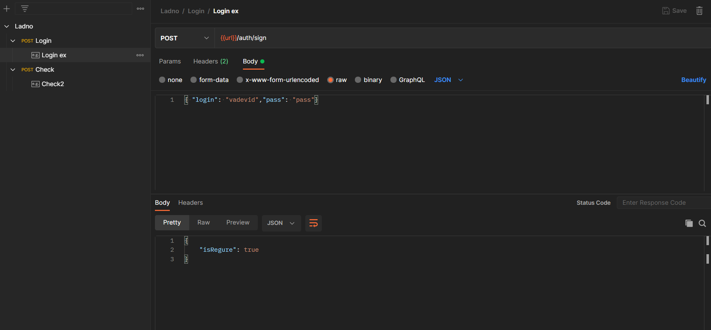

<p align = center>МИНИСТЕРСТВО НАУКИ И ВЫСШЕГО ОБРАЗОВАНИЯ

<p align = center>РОССИЙСКОЙ ФЕДЕРАЦИИ

<p align = center>ФЕДЕРАЛЬНОЕ ГОСУДАРСТВЕННОЕ БЮДЖЕТНОЕ ОБРАЗОВАТЕЛЬНОЕ УЧРЕЖДЕНИЕ ВЫСШЕГО ОБРАЗОВАНИЯ

<p align = center>«ВЯТСКИЙ ГОСУДАРСТВЕННЫЙ УНИВЕРСИТЕТ»

<p align = center>Институт математики и информационных систем

<p align = center>Факультет автоматики и вычислительной техники

<p align = center>Кафедра систем автоматизации управления
<br>
<br>
<br>
<br>

<p align = right>Дата сдачи на проверку:

<p align = right>«___» __________ 2022 г.

<p align = right>Проверено:

<p align = right>«___» __________ 2022 г.
<br>
<br>
<br>
<br>
<br>

<p align = center>Отчет по лабораторной работе № 3

<p align = center>по дисциплине

<p align = center>«Web-программирование»

<br>
<br>
<br>
<br>

<p align = center>Разработал студент гр. ИТб-2301-01-00 ________________ /Кислицын И.А./

<p align = center>Проверил ст. преподаватель _________________ /Земцов М.А./

<p align = center>Работа защищена с оценкой «___________» «___» __________ 2022 г.

<br>
<br>
<br>
<br>

<p align = center>Киров 2022

<hr>
Цель:  провести тестирование отправки axios-запроса на mock-сервер

Задачи:

1. Организовать процесс работы над лабораторной работой
1. Сверстать блок регистрации
1. Создать mock-сервер в Postman
1. Отправить запрос на mock-сервер и получить ответ

Ход выполнения:

1. Организовать процесс работы над лабораторной работой

Для работы в репозитории _[ссылка на репозиторий](https://github.com/vadevid/WEB)_ на сайте github.com была создана новая ветвь с названием lab3 от ветки lab2.

2. Сверстать блок регистрации

В компонент Registration была добавлена адаптивная верстка блока регистрации. Результут представлен на рисунке 1 и 2.

<p align=center></p>

<p align = center>Рисунок 1 – Регистрация desctop

<p align=center></p>

<p align = center>Рисунок 2 – Регистрация для мобильных устройств

3. Создать mock-сервер в Postman

В ходе выполнения работы с помощью Postman был создан Mock Server. Созданный Mock Server представлен на рисунке 3.

<p align=center></p>

<p align = center>Рисунок 3 – Mock Server

В рамках лабораторной работы были созданы два Post запроса.
В первом случае Post запрос используется для проверки введенного логина и пароля. Реализация запроса изображена на рисунке 4. Результаты его работы показаны на рисунках 5 и 6.

<p align=center></p>

<p align = center>Рисунок 4 – Post запрос

<p align=center></p>

<p align = center>Рисунок 5 – Удачный вход

<p align=center></p>

<p align = center>Рисунок 6 – Неудачный вход

Во втором случае Post запрос используется для проверки уникальности логина при регистрации. Реализация запроса изображена на рисунке 7. Результаты его работы показаны на рисунках 8 и 9.

<p align=center></p>

<p align = center>Рисунок 7 – Post запрос

<p align=center></p>

<p align = center>Рисунок 8 – Удачная регистрация

<p align=center></p>

<p align = center>Рисунок 9 – Неудачная регистрация

В компоненте Registration предусмотрена проверка на ввод почты, пароля и совпадения введенных паролей
Листинг компонента Registration представлен в приложении А.

Вывод: в ходе лабораторной работы было проведено тестирование отправки axios-запроса на mock-сервер.

<p align = center>Приложение А

<p align = center>(обязательное)

<p align = center>Листинг компонента Regisration.vue

```html
<template>
  <div>
    <div class="switch">
      <a type="button" class="EnterBtn" v-on:click="toggleStyleEnter">Вход</a>
      <a type="button" class="RegBtn" v-on:click="toggleStyleRegister"
        >Регистрация</a
      >
    </div>
    <div class="container">
      <div class="logo">
        
        
      </div>
      <div class="autorization_block">
        <h1 class="title">Авторизация</h1>
        <div class="input-block">
          <p>Логин</p>
          <input type="text" id="log" placeholder="Логин" />
        </div>
        <div class="input-block">
          <p>Пароль</p>
          <input type="password" id="password" placeholder="Пароль" />
        </div>
        <div class="save">
          <input type="checkbox" />
          <h3 class="save-text">Сохранить</h3>
        </div>
        <div>
          <button type="button" class="Enter-btn" v-on:click="signIn">
            Авторизоваться
          </button>
        </div>
      </div>
      <div class="registrationtion_block">
        <h1 class="title">Регистрация</h1>
        <div class="input-block">
          <p>Почта</p>
          <input type="email" placeholder="email" id="regEmail" />
        </div>
        <div class="input-block">
          <p>Логин</p>
          <input type="text" placeholder="Логин" id="regLog" />
        </div>
        <div class="input-block">
          <p>Пароль</p>
          <input type="password" placeholder="Пароль" id="regPass" />
        </div>
        <div class="input-block">
          <p>Повторите пароль</p>
          <input type="password" placeholder="Пароль" id="regPass2" />
        </div>
        <div>
          <button type="button" class="Enter-btn mt-20" v-on:click="signOn">
            Зарегистрироваться
          </button>
        </div>
      </div>
    </div>
  </div>
</template>

<script lang="ts">
  import axios from "axios";
  export default {
    methods: {
      toggleStyleEnter() {
        const enter: HTMLDivElement = document.querySelector(
          ".autorization_block"
        );
        const reg: HTMLDivElement = document.querySelector(
          ".registrationtion_block"
        );
        const enterBtn: HTMLDivElement = document.querySelector(".EnterBtn");
        const regBtn: HTMLDivElement = document.querySelector(".RegBtn");
        enter.style.display = "flex";
        reg.style.display = "none";
        enterBtn.style.color = "green";
        regBtn.style.color = "black";
      },
      toggleStyleRegister() {
        const enter: HTMLDivElement = document.querySelector(
          ".autorization_block"
        );
        const reg: HTMLDivElement = document.querySelector(
          ".registrationtion_block"
        );
        const enterBtn: HTMLDivElement = document.querySelector(".EnterBtn");
        const regBtn: HTMLDivElement = document.querySelector(".RegBtn");
        enter.style.display = "none";
        reg.style.display = "flex";
        enterBtn.style.color = "black";
        regBtn.style.color = "green";
      },
      signIn() {
        const log: HTMLInputElement = document.getElementById(
          "log"
        ) as HTMLInputElement;
        const password: HTMLInputElement = document.getElementById(
          "password"
        ) as HTMLInputElement;
        const config = {
          url: "https://b83c67c6-f6e2-44a3-b933-0dbe68ae85c0.mock.pstmn.io/auth/login",
        };
        const data = {
          login: log.value,
          password: password.value,
        };
        axios
          .post(config.url, data, {
            headers: { "x-mock-match-request-body": true },
          })
          .then((response) => {
            console.log(response.data.completed);
            if (response.data.completed) {
              alert("Успешно!");
            }
          })
          .catch((error) => {
            console.log(error);
            alert("Неверный логин или пароль!");
          });
      },
      signOn() {
        const regLog: HTMLInputElement = document.getElementById(
          "regLog"
        ) as HTMLInputElement;
        const regPass: HTMLInputElement = document.getElementById(
          "regPass"
        ) as HTMLInputElement;
        const regPass2: HTMLInputElement = document.getElementById(
          "regPass2"
        ) as HTMLInputElement;
        const regEmail: HTMLInputElement = document.getElementById(
          "regEmail"
        ) as HTMLInputElement;
        const config = {
          url: "https://b83c67c6-f6e2-44a3-b933-0dbe68ae85c0.mock.pstmn.io/auth/check",
        };
        const data = {
          login: regLog.value,
        };
        if (regEmail.value === "") {
          alert("Введите почту!");
          return;
        }
        if (regLog.value === "") {
          alert("Введите логин!");
          return;
        }
        if (regPass.value === "") {
          alert("Введите пароль!");
          return;
        }
        if (regPass.value !== regPass2.value) {
          alert("Пароли не совпадают!");
          return;
        }
        axios
          .post(config.url, data, {
            headers: { "x-mock-match-request-body": true },
          })
          .then((response) => {
            console.log(response.data.isValid);
            if (response.data.isValid) {
              alert("Логин занят!");
            }
          })
          .catch((error) => {
            console.log(error);
            alert("Успешно!");
          });
      },
    },
  };
</script>
<style scoped>
  .input-block input::placeholder {
    color: white;
  }
  .container {
    width: 100%;
    margin: 0 auto;
    display: flex;
    justify-content: center;
  }
  .switch {
    text-align: center;
    margin: 30px 0px;
  }
  .switch a {
    font-size: 30px;
    padding: 5px 10px;
  }
  .EnterBtn {
    color: green;
    cursor: pointer;
  }
  .RegBtn {
    color: black;
    cursor: pointer;
  }
  .mt-20 {
    margin-top: 10px;
  }
  .logo {
    margin-right: 10px;
  }
  .biglogo-img {
    height: 280px;
  }
  .logo-img {
    display: none;
  }
  .autorization_block {
    display: flex;
    align-items: center;
    flex-direction: column;
  }
  .registrationtion_block {
    display: none;
    align-items: center;
    flex-direction: column;
  }
  .title {
    margin-top: 0;
    margin-bottom: 10px;
  }
  .save {
    display: flex;
    margin: 20px 0px 10px 0px;
  }
  .save-text {
    margin: 0 auto;
    margin-left: -1px;
  }
  .save input {
    cursor: pointer;
  }
  .Enter-btn {
    background-color: green;
    padding: 14px 26px;
    border-radius: 5px;
    font-size: 16px;
    color: white;
    cursor: pointer;
  }
  .input-block p {
    margin-bottom: 0px;
  }
  .input-block input {
    font-size: 20px;
    text-decoration: none;
    padding: 2px 1px;
    margin-bottom: 10px;
  }
  @media (max-width: 600px) {
    .container {
      display: block;
    }
    .biglogo-img {
      display: none;
    }
    .logo-img {
      display: block;
      margin: 0 auto;
      height: 100px;
    }
    .input-block input::placeholder {
      color: gray;
    }
    .input-block p {
      display: none;
    }
  }
  @media (max-width: 260px) {
    .input-mobil input {
      width: 180px;
    }
  }
</style>
```
