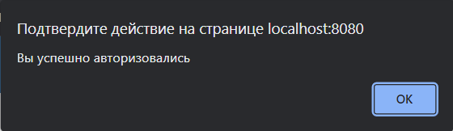
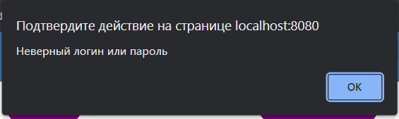
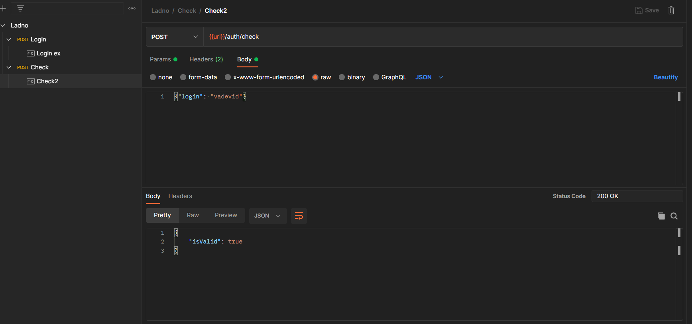
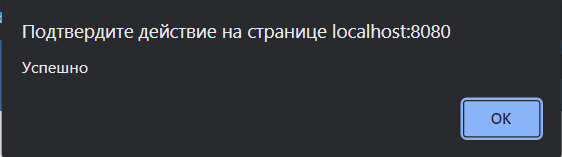
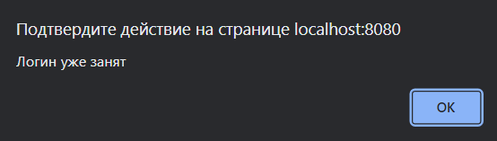

<p align = center>МИНИСТЕРСТВО НАУКИ И ВЫСШЕГО ОБРАЗОВАНИЯ

<p align = center>РОССИЙСКОЙ ФЕДЕРАЦИИ

<p align = center>ФЕДЕРАЛЬНОЕ ГОСУДАРСТВЕННОЕ БЮДЖЕТНОЕ ОБРАЗОВАТЕЛЬНОЕ УЧРЕЖДЕНИЕ ВЫСШЕГО ОБРАЗОВАНИЯ

<p align = center>«ВЯТСКИЙ ГОСУДАРСТВЕННЫЙ УНИВЕРСИТЕТ»

<p align = center>Институт математики и информационных систем

<p align = center>Факультет автоматики и вычислительной техники

<p align = center>Кафедра систем автоматизации управления
<br>
<br>
<br>
<br>

<p align = right>Дата сдачи на проверку:

<p align = right>«___» __________ 2022 г.

<p align = right>Проверено:

<p align = right>«___» __________ 2022 г.
<br>
<br>
<br>
<br>
<br>

<p align = center>Отчет по лабораторной работе № 3

<p align = center>по дисциплине

<p align = center>«Web-программирование»

<br>
<br>
<br>
<br>

<p align = center>Разработал студент гр. ИТб-2301-01-00 ________________ /Кислицын И.А./

<p align = center>Проверил ст. преподаватель _________________ /Земцов М.А./

<p align = center>Работа защищена с оценкой «___________» «___» __________ 2022 г.

<br>
<br>
<br>
<br>

<p align = center>Киров 2022

<hr>
Цель:  провести тестирование отправки axios-запроса на mock-сервер

Задачи:

1. Организовать процесс работы над лабораторной работой
1. Сверстать блок регистрации
1. Создать mock-сервер в Postman
1. Отправить запрос на mock-сервер и получить ответ

Ход выполнения:

1. Организовать процесс работы над лабораторной работой

Для работы в репозитории _[ссылка на репозиторий](https://github.com/vadevid/WEB)_ на сайте github.com была создана новая ветвь с названием lab3 от ветки lab2.

2. Сверстать блок регистрации

В компонент Registration была добавлена адаптивная верстка блока регистрации. Результут представлен на рисунке 1 и 2.

<p align=center></p>

<p align = center>Рисунок 1 – Регистрация desctop

<p align=center></p>

<p align = center>Рисунок 2 – Регистрация для мобильных устройств

3. Создать mock-сервер в Postman

В ходе выполнения работы с помощью Postman был создан Mock Server. Созданный Mock Server представлен на рисунке 3.

<p align=center></p>

<p align = center>Рисунок 3 – Mock Server

В рамках лабораторной работы были созданы два Post запроса.
В первом случае Post запрос используется для проверки введенного логина и пароля. Реализация запроса изображена на рисунке 4. Результаты его работы показаны на рисунках 5 и 6.

<p align=center></p>

<p align = center>Рисунок 4 – Post запрос

<p align=center></p>

<p align = center>Рисунок 5 – Удачный вход

<p align=center></p>

<p align = center>Рисунок 6 – Неудачный вход

Во втором случае Post запрос используется для проверки уникальности логина при регистрации. Реализация запроса изображена на рисунке 7. Результаты его работы показаны на рисунках 8 и 9.

<p align=center></p>

<p align = center>Рисунок 7 – Post запрос

<p align=center></p>

<p align = center>Рисунок 8 – Удачная регистрация

<p align=center></p>

<p align = center>Рисунок 9 – Неудачная регистрация

В компоненте Registerпредусмотрена проверка на ввод почты, пароля и совпадения введенных паролей
Листинг компонента Register представлен в приложении А.

Вывод: в ходе лабораторной работы было проведено тестирование отправки axios-запроса на mock-сервер.

<p align = center>Приложение А

<p align = center>(обязательное)

<p align = center>Листинг компонента Register.vue

```html
<template>
  <div class="form-div">
    
    <form class="form">
      
      <h3 class="form_title">Регистрация</h3>
      <div class="desktop_input">
        <span class="email-text">Email: </span>
        <input type="text" class="form_input" id="email-text" />
      </div>
      <div class="desktop_input">
        <span>Логин: </span>
        <input type="text" class="form_input" id="login-text" />
      </div>
      <div class="desktop_input">
        <span>Пароль: </span>
        <input type="password" class="form_input" id="pass-text" />
      </div>
      <div class="desktop_input">
        <span>Повторить пароль: </span>
        <input type="password" class="form_input" id="pass2-text" />
      </div>
      <div class="mobile_input">
        <input
          type="text"
          class="form_input"
          placeholder="Email"
          id="email-text"
        />
      </div>
      <div class="mobile_input">
        <input
          type="text"
          class="form_input"
          id="login-text"
          placeholder="Логин"
        />
      </div>
      <div class="mobile_input">
        <input
          type="password"
          class="form_input"
          id="pass-text"
          placeholder="Пароль"
        />
      </div>
      <div class="mobile_input">
        <input
          type="password"
          class="form_input"
          id="pass2-text"
          placeholder="Повторите пароль"
        />
      </div>
      <p>
        <input class="checkbox" id="input" type="checkbox" />
        <label class="checkbox_text" for="input"
          >Запомнить данные пользователя</label
        >
      </p>
      <p>
        <button class="form_btn" type="button" v-on:click="signUp">
          Зарегестрироваться
        </button>
      </p>
    </form>
  </div>
</template>

<script lang="ts">
  import axios from "axios";

  export default {
    methods: {
      signUp() {
        const email: HTMLInputElement = document.getElementById(
          "email-text"
        ) as HTMLInputElement;
        const regLogin: HTMLInputElement = document.getElementById(
          "login-text"
        ) as HTMLInputElement;
        const pass: HTMLInputElement = document.getElementById(
          "pass-text"
        ) as HTMLInputElement;
        const pass2: HTMLInputElement = document.getElementById(
          "pass2-text"
        ) as HTMLInputElement;
        const config = {
          url: "https://690df4bc-7e06-4e17-8caa-3370b8c65949.mock.pstmn.io/auth/check",
        };
        const data = {
          login: regLogin.value,
        };
        if (email.value === "") {
          alert("Введите почту");
          return;
        }
        if (regLogin.value === "") {
          alert("Введите логин");
          return;
        }
        if (pass.value === "") {
          alert("Введите пароль");
          return;
        }
        if (pass.value !== pass2.value) {
          alert("Пароли не совпадают");
          return;
        }
        axios
          .post(config.url, data, {
            headers: { "x-mock-match-request-body": true },
          })
          .then((response) => {
            if (response.data.isValid) {
              alert("Логин уже занят");
            }
          })
          .catch((error) => {
            alert("Успешно");
          });
      },
    },
  };
</script>

<style>
  .desktop_input {
    display: flex;
    flex-direction: column;
  }
  .form-div {
    display: flex;
    align-items: center;
  }
  .logo_big {
    width: 40%;
    background: #444;
  }
  .mobile_input {
    display: none;
  }
  .logo {
    display: none;
    width: 20%;
    padding-top: 10px;
  }
  .form {
    display: flex;
    flex-direction: column;
    width: 50%;
    margin-left: 10px;
  }
  .form_title {
    font-size: 1.5rem;
    font-weight: 500;
    color: #333;
  }
  .form_input {
    margin: 5px 0;
    width: 90%;
    padding: 10px;
    border: solid 1px #333;
    font-size: inherit;
  }
  .form_btn {
    border: none;
    cursor: pointer;
    font-size: inherit;
    background-color: #03a9f4;
    color: #fff;
    padding: 10px 50px;
  }
  @media (max-width: 768px) {
    .desktop_input {
      display: none;
    }
    .checkbox_text {
      font-size: 32px;
    }
    .mobile_input {
      display: flex;
      width: 100%;
    }
    .form_btn {
      width: 100%;
      font-size: 32px;
      padding: 20px 100px;
    }
    .form_title {
      font-size: 48px;
    }
    .form_input {
      font-size: 32px;
    }
    .form {
      align-items: center;
      width: 100vw;
    }
    .logo_big {
      display: none;
    }
    .logo {
      display: flex;
    }
  }
  @media (max-width: 480px) {
    .logo {
      width: 50%;
    }
    .form-div {
      width: 100%;
    }
  }
</style>
```
