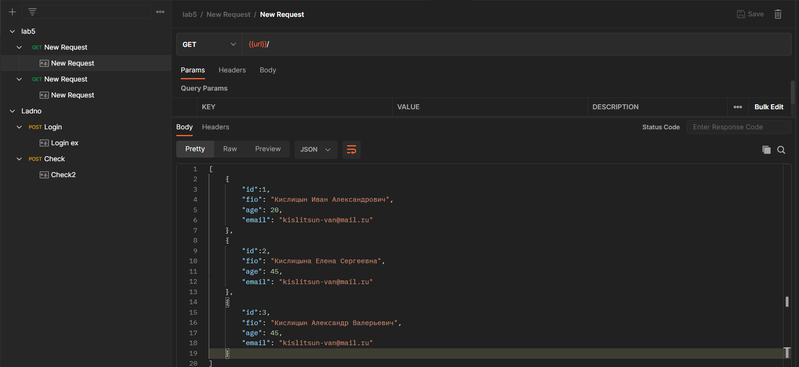
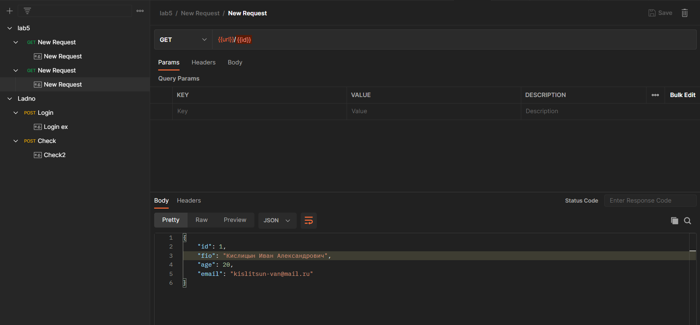
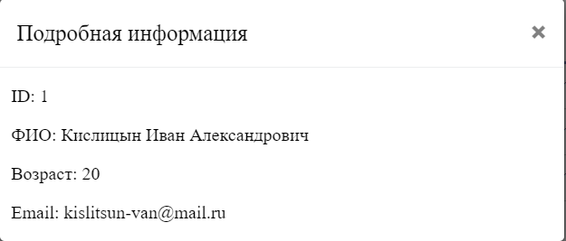

<p align = center>МИНИСТЕРСТВО НАУКИ И ВЫСШЕГО ОБРАЗОВАНИЯ

<p align = center>РОССИЙСКОЙ ФЕДЕРАЦИИ

<p align = center>ФЕДЕРАЛЬНОЕ ГОСУДАРСТВЕННОЕ БЮДЖЕТНОЕ ОБРАЗОВАТЕЛЬНОЕ УЧРЕЖДЕНИЕ ВЫСШЕГО ОБРАЗОВАНИЯ

<p align = center>«ВЯТСКИЙ ГОСУДАРСТВЕННЫЙ УНИВЕРСИТЕТ»

<p align = center>Институт математики и информационных систем

<p align = center>Факультет автоматики и вычислительной техники

<p align = center>Кафедра систем автоматизации управления
<br>
<br>
<br>
<br>

<p align = right>Дата сдачи на проверку:

<p align = right>«___» __________ 2022 г.

<p align = right>Проверено:

<p align = right>«___» __________ 2022 г.
<br>
<br>
<br>
<br>
<br>

<p align = center>Отчет по лабораторной работе № 5

<p align = center>по дисциплине

<p align = center>«Web-программирование»

<br>
<br>
<br>
<br>

<p align = center>Разработал студент гр. ИТб-2301-01-00 ________________ /Кислицын И.А./

<p align = center>Проверил ст. преподаватель _________________ /Земцов М.А./

<p align = center>Работа защищена с оценкой «___________» «___» __________ 2022 г.

<br>
<br>
<br>
<br>

<p align = center>Киров 2022

<hr>
Цель:  получить данные с Mock Server. Отобразить их в виде таблицы.

Задачи:

1. Организовать процесс работы над лабораторной работой
1. Отправить запрос на mock-сервер и получить ответ в виде таблицы
1. По нажатию на строку таблицы выводить информацию в модальное окно

Ход выполнения:

1. Организовать процесс работы над лабораторной работой

Для работы в репозитории _[ссылка на репозиторий](https://github.com/vadevid/WEB)_ на сайте github.com была создана новая ветвь lab5.

2. Отправить запрос на mock-сервер и получить ответ в виде таблицы

В ходе лабораторной работы был создан новый Mock Server в Postman. Для вывода информации в таблицу был написан Get-запрос, представленный на рисунке 1. В проекте был создан новый компонент table, который содержит в себе верстку таблицы. Заполненная таблица изображена на рисунке 2. Листинг компонента table приведен в приложении А.

<p align=center></p>

<p align = center>Рисунок 1 – Get-запрос массив

<p align=center></p>

<p align = center>Рисунок 2 – Результат Get-запроса

3. По нажатию на строку таблицы выводить информацию в модальное окно

Для реализации в компонент table было добавлено модальное окно. В коллекции Postman создан новый Get-запрос. Запрос представлен на рисунке 3, а результат его работы на рисунке 4.

<p align=center></p>

<p align = center>Рисунок 3 – Get-запрос

<p align=center></p>

<p align = center>Рисунок 4 – Модальное окно

Вывод: в ходе выполнения лабораторной работы были получены данные с mock-сервера. Данные отображены в таблицу с возможностью просмотра полной информации в модальном окне по нажатию на строку таблицы.

<p align = center>Приложение А

<p align = center>(обязательное)

<p align = center>Листинг компонента table.vue

```html
<template>
  <div class="conteiner">
    <button type="button" v-on:click="GetList">Вывод таблицы</button>
    <loader v-if="loading" />
    <table v-else>
      <tr>
        <th>id</th>
        <th>ФИО</th>
        <th>Возраст</th>
        <th>Почта</th>
      </tr>
      <tr v-on:click="FindById(item.id)" v-for="(item) in list" :key="item.id">
        <td>{{ item.id }}</td>
        <td>{{ item.fio }}</td>
        <td>{{ item.age }}</td>
        <td>{{ item.email }}</td>
      </tr>
    </table>
    <div id="openModal" class="modal">
      <div class="modal-dialog">
        <div class="modal-content">
          <div class="modal-header">
            <h3 class="modal-title">Подробная информация</h3>
            <a v-on:click="CloseModal" class="close">×</a>
          </div>
          <div class="modal-body">
            <p>ID: {{element.id}}</p>
            <p>ФИО: {{element.fio}}</p>
            <p>Возраст: {{element.age}}</p>
            <p>Email: {{element.email}}</p>
          </div>
        </div>
      </div>
    </div>
  </div>
</template>

<script lang="ts">
  import axios from "axios";

  export default {
    data: () => ({
      loading: true,
      list: [],
      element: {},
    }),
    methods: {
      GetList() {
        const config = {
          url: "https://8ec468a2-6c3b-4797-a0df-e2cfb9329e22.mock.pstmn.io",
        };
        axios
          .get(config.url)
          .then((response) => {
            console.log(response.data);
            this.list = response.data;
            this.loading = false;
          })
          .catch((error) => {
            console.log(error);
          });
      },
      FindById(i) {
        const config = {
          url: "https://8ec468a2-6c3b-4797-a0df-e2cfb9329e22.mock.pstmn.io/",
        };
        axios
          .get(config.url + i)
          .then((response) => {
            console.log(response.data);
            this.element = response.data;
            const modal: HTMLDivElement = document.querySelector("#openModal");
            modal.style.opacity = "1";
            modal.style.pointerEvents = "auto";
            modal.style.overflowY = "auto";
          })
          .catch((error) => {
            console.log(error);
          });
      },
      CloseModal() {
        const modal: HTMLDivElement = document.querySelector("#openModal");
        modal.style.opacity = "0";
        modal.style.pointerEvents = "none";
      },
    },
  };
</script>
<style scroped>
  .conteiner {
    margin: 0 auto;
    text-align: center;
  }
  button {
    padding: 8px;
    background-color: #e8edff;
    border-radius: 4px;
    cursor: pointer;
    margin: 0 10px;
    color: #039;
    border-color: #039;
    font-size: 14px;
    font-weight: 600;
  }
  button:active {
    color: black;
    background-color: #039;
    border-color: black;
  }
  table {
    font-family: "Lucida Sans Unicode", "Lucida Grande", Sans-Serif;
    font-size: 14px;
    background: white;
    max-width: 70%;
    width: 70%;
    border-collapse: collapse;
    text-align: left;
    margin: 0 auto;
  }
  th {
    font-weight: normal;
    color: #039;
    border-bottom: 2px solid #6678b1;
    padding: 10px 8px;
  }
  td {
    color: #669;
    padding: 9px 8px;
    transition: 0.3s linear;
    border-bottom: 1px solid #ccc;
  }
  tr:hover td {
    background: #e8edff;
    cursor: pointer;
  }
  .modal {
    position: fixed;
    top: 0;
    right: 0;
    bottom: 0;
    left: 0;
    background: rgba(0, 0, 0, 0.5);
    z-index: 1050;
    opacity: 0;
    -webkit-transition: opacity 200ms ease-in;
    -moz-transition: opacity 200ms ease-in;
    transition: opacity 200ms ease-in;
    pointer-events: none;
    margin: 0;
    padding: 0;
  }
  .modal:target {
    opacity: 1;
    pointer-events: auto;
    overflow-y: auto;
  }
  .modal-dialog {
    position: relative;
    width: auto;
    margin: 10px;
  }
  @media (min-width: 576px) {
    .modal-dialog {
      max-width: 500px;
      margin: 30px auto;
    }
  }
  .modal-content {
    position: relative;
    display: -webkit-box;
    display: -webkit-flex;
    display: -ms-flexbox;
    display: flex;
    -webkit-box-orient: vertical;
    -webkit-box-direction: normal;
    -webkit-flex-direction: column;
    -ms-flex-direction: column;
    flex-direction: column;
    background-color: #fff;
    -webkit-background-clip: padding-box;
    background-clip: padding-box;
    border: 1px solid rgba(0, 0, 0, 0.2);
    border-radius: 0.3rem;
    outline: 0;
  }
  @media (min-width: 768px) {
    .modal-content {
      -webkit-box-shadow: 0 5px 15px rgba(0, 0, 0, 0.5);
      box-shadow: 0 5px 15px rgba(0, 0, 0, 0.5);
    }
  }
  .modal-header {
    display: -webkit-box;
    display: -webkit-flex;
    display: -ms-flexbox;
    display: flex;
    -webkit-box-align: center;
    -webkit-align-items: center;
    -ms-flex-align: center;
    align-items: center;
    -webkit-box-pack: justify;
    -webkit-justify-content: space-between;
    -ms-flex-pack: justify;
    justify-content: space-between;
    padding: 15px;
    border-bottom: 1px solid #eceeef;
  }
  .modal-title {
    margin-top: 0;
    margin-bottom: 0;
    line-height: 1.5;
    font-size: 1.25rem;
    font-weight: 500;
  }
  .close {
    float: right;
    font-family: sans-serif;
    font-size: 24px;
    font-weight: 700;
    line-height: 1;
    color: #000;
    text-shadow: 0 1px 0 #fff;
    opacity: 0.5;
    text-decoration: none;
  }
  .close:focus,
  .close:hover {
    color: #000;
    text-decoration: none;
    cursor: pointer;
    opacity: 0.75;
  }
  .modal-body {
    margin-left: 10px;
    text-align: left;
  }
</style>
```
