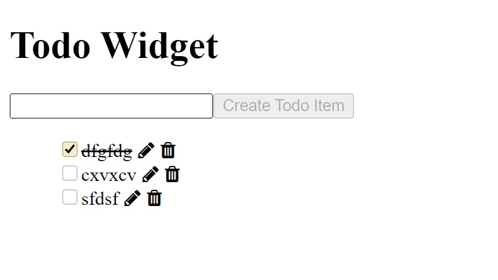
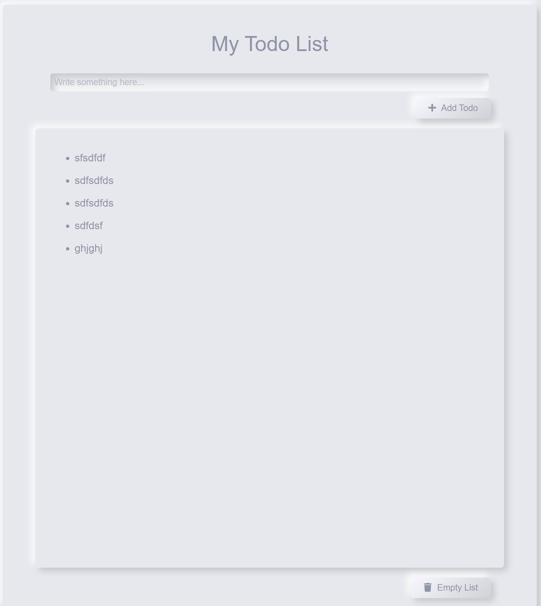

МИНИСТЕРСТВО НАУКИ И ВЫСШЕГО ОБРАЗОВАНИЯ

РОССИЙСКОЙ ФЕДЕРАЦИИ

ФЕДЕРАЛЬНОЕ ГОСУДАРСТВЕННОЕ БЮДЖЕТНОЕ ОБРАЗОВАТЕЛЬНОЕ УЧРЕЖДЕНИЕ ВЫСШЕГО ОБРАЗОВАНИЯ

«ВЯТСКИЙ ГОСУДАРСТВЕННЫЙ УНИВЕРСИТЕТ»

Институт математики и информационных систем

Факультет автоматики и вычислительной техники

Кафедра систем автоматизации управления
 
 
 
 

Дата сдачи на проверку:

«___» __________ 2022 г.

Проверено:

«___» __________ 2022 г.
 
 
 
 
 

Отчет по лабораторной работе № 6

по дисциплине

«Web-программирование»

 
 
 
 

Разработал студент гр. ИТб-2301-01-00 ________________ /Кислицын И.А./

Проверил ст. преподаватель _________________ /Земцов М.А./

Работа защищена с оценкой «___________» «___» __________ 2022 г.

 
 
 
 

Киров 2022

Цель: сравнить менеджеры состояний (компонентов) для Angular на примере ToDo list.

Задачи:

1. Организовать процесс работы над лабораторной работой
1. Менеджер состояний NgRx
1. Менеджер состояний NgXs
1. Сравнение менеджеров состояний

Ход выполнения:

1. Организовать процесс работы над лабораторной работой

Для работы в репозитории _[ссылка на репозиторий](https://github.com/vadevid/WEB)_ на сайте github.com были созданы две новые ветки для каждого рассматриваемого менеджера состояний.

2. Менеджер состояний NgRx

NGRX — это группа библиотек, «вдохновленных» шаблоном Redux, который, в свою очередь, «вдохновлен» шаблоном Flux. Проще говоря, это означает, что шаблон Redux является упрощенной версией Flux шаблона, а NGRX — angular/rxjs версией Redux шаблона.

Наиболее важные преимущества использования redux шаблона в приложении (на мой взгляд):

- Поскольку у нас есть единый источник правды, и вы не можете напрямую изменить состояние, приложения будут работать более согласованно.
- Использование redux шаблона дает нам много интересных функций, облегчающих отладку.
- Тестирование приложений становится проще, поскольку мы вводим простые функции для обработки изменений состояния, а также потому, что оба, ngrx и rxjs, имеют множество замечательных возможностей для тестирования.
- Как только вы почувствуете себя комфортно при использовании ngrx, понимание потока данных в ваших приложениях станет невероятно простым и предсказуемым.

В ходе лабораторной работы был изучен пример реализации приложения todo list. Приложение добавлено в git https://github.com/vadevid/WEB/tree/lab6_ngrx. Результат работы приложения представлен на рисунке 1.

Рисунок 1 – Todo list на NgRx

3. Менеджер состояний NgXs

NGXS — это альтернативная библиотека для управления состоянием в Angular-приложениях, похожая на Redux.

Если ngrx разделяет синхронные и асинхронные action’ы, то в ngxs благодаря подходу описанию экшенов, позволяет объединить синхронные и асинхронные action’ы. Принцип работы аналогичен выше описанному.

Особенности NGXS заключаются в том, что здесь используется множество классов и декораторов. Делается это для уменьшения объёмов шаблонного кода. Вероятно, эта особенность NGXS может стать решающей при выборе библиотеки для управления состоянием в том случае, если тот, кто ищет подобную библиотеку, привык пользоваться классами.

Был рассмотрен пример реализации приложения todo list. Приложение добавлено в git https://github.com/vadevid/WEB/tree/lab6_rgxs. Результат работы приложения представлен на рисунке 2.

Рисунок 2 – Todo list на NgXs

4. Сравнение менеджеров состояний

Каждый менеджер состояния может заменить другой. При выборе того или другого стоит обратить внимание на объем проекта, удобства использования менеджера и скорость его работы.

Вывод: в ходе выполнения лабораторной работы рассмотрены два менеджера состояний на примере реализации приложения ToDo list и выявлены их особенности. В результате исследования было выявлено, что наиболее оптимальным решениям является использование менеджера состояний NgRx.
